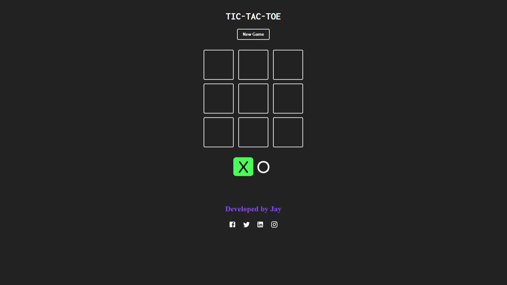

# [TIC TAC TOE GAME](https://kjcreddy666.github.io/tictactoe/)

## Description
This is a simple Tic Tac Toe game that can be played by two players. The game is played on a 3x3 grid and the players take turns to place their mark (X or O) on the grid. The first player to get three of their marks in a row (horizontally, vertically or diagonally) wins the game. If all the cells on the grid are filled and no player has won, the game ends in a draw.    

## Technologies Used
- HTML5
- CSS3
- JavaScript
- ReactJS

## How to Run the Game
1. Clone the repository to your local machine.
2. Open the project in your code editor.
3. Run `npm install` to install the dependencies.
4. Run `npm start` to start the development server.
5. Open your browser and navigate to `http://localhost:3000/` to play the game.